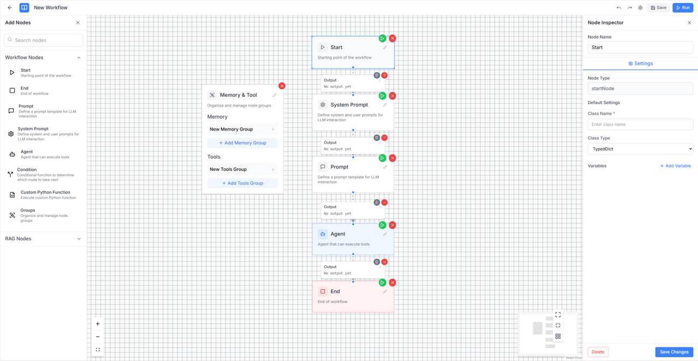
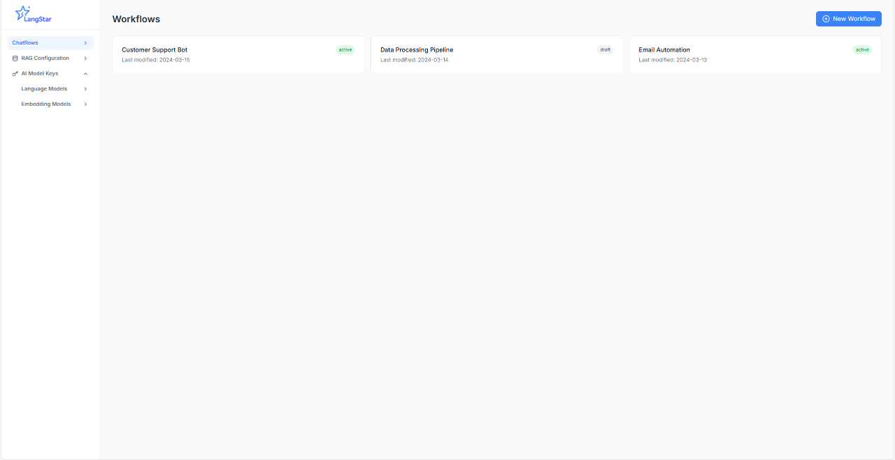
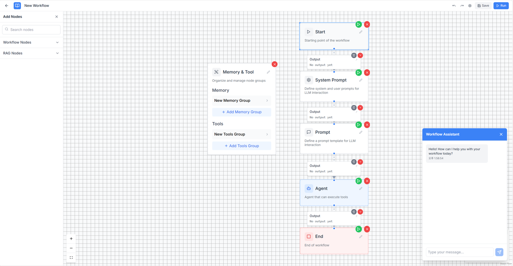
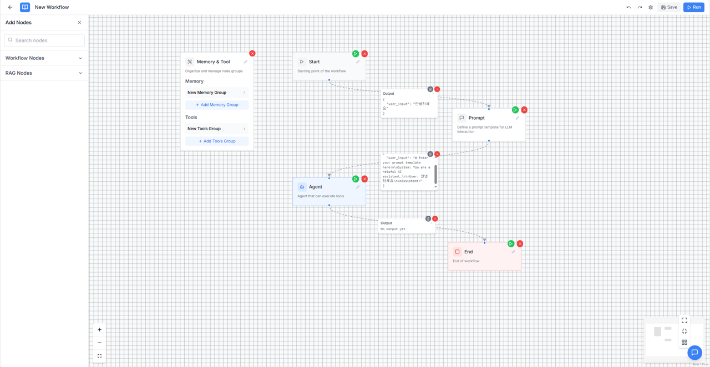

# 🌟 LangStar

**Langstar** is a visual platform that enables both developers and non-developers to easily create **LLM-based agent models** using **drag-and-drop** components. Once built, these models can be automatically converted into **Python code** for deployment.

---

## 🎯 Project Goals

- Lower the barrier to entry for non-developers working with LLM agents  
- Allow intuitive, drag-and-drop-based visual modeling  
- Automatically generate clean, modular Python code  
- Enable one-click deployment and testing  
- Save development time and promote accessibility

---

# ✨ Key Features

- ✅ **Visual Agent Builder**  
  Drag-and-drop UI to visually compose agents, tools, memory blocks, and conditionals without writing a line of code.

- ✅ **Modular Architecture**  
  Components like LLMs, APIs, documents, RAG pipelines, and memory modules can be easily reused and extended.

- ✅ **Automatic Code Generation**  
  Instantly convert your workflow into production-ready Python code — readable and customizable.

- ✅ **Real-Time Block Execution for Debugging**  
  Execute each block independently during design time and immediately view inputs, outputs, and errors.  
  This dramatically improves debugging and understanding of how data flows through the agent.

- ✅ **Extensible for Developers**  
  For advanced users, Langstar offers hooks and customization options for logic and code injection.

---

## 🖼️ Screenshots
1. **Create your custom workflow**  
   Drag and drop components to build your own LLM agent pipeline.

   

2. **Manage workflows, API keys, and RAG settings**  
   Organize and configure your agent flows, keys, and retrieval-augmented generation (RAG) options.

   

3. **Chat with your agent in real time**  
   Interact with the deployed agent using a real-time chat interface based on your completed workflow.

   

4. **Debug in Real Time with Per-Block Execution**  
   Run and inspect each block individually during design.  
   Check intermediate outputs and fix issues early — no need to run the entire workflow every time.

   