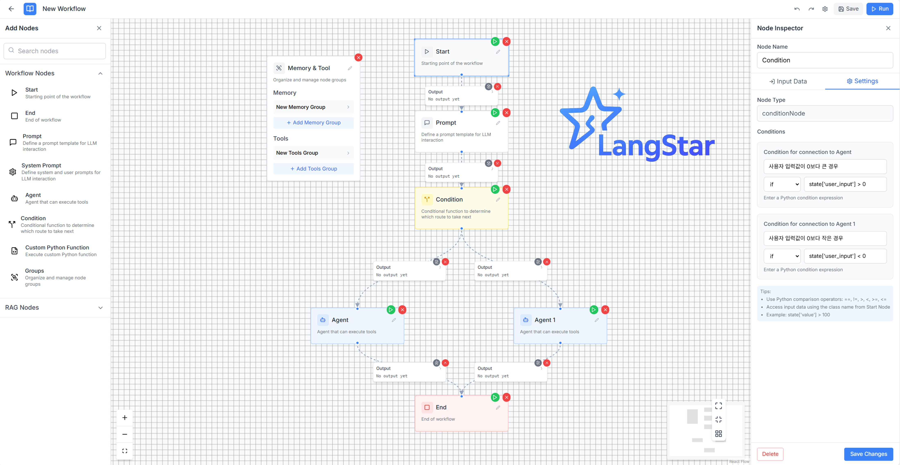

> 🚧 **Langstar is currently under development.**
> This project is currently in active development. Features, structure, and documentation may change frequently.

# 🌟 LangStar

**Langstar** is a visual platform that enables both developers and non-developers to easily create **LLM-based agent models** using **drag-and-drop** components. Once built, these models can be automatically converted into **Python code** for deployment.

---

## 🎯 Project Goals

- Lower the barrier to entry for non-developers working with LLM agents  
- Allow intuitive, drag-and-drop-based visual modeling  
- Automatically generate clean, modular Python code  
- Enable one-click deployment and testing  
- Save development time and promote accessibility

---

# ✨ Key Features

- ✅ **Visual Agent Builder**  
  Drag-and-drop UI to visually compose agents, tools, memory blocks, and conditionals without writing a line of code.

- ✅ **Modular Architecture**  
  Components like LLMs, APIs, documents, RAG pipelines, and memory modules can be easily reused and extended.

- ✅ **Automatic Code Generation**  
  Instantly convert your workflow into production-ready Python code — readable and customizable.

- ✅ **Real-Time Block Execution for Debugging**  
  Execute each block independently during design time and immediately view inputs, outputs, and errors.  
  This dramatically improves debugging and understanding of how data flows through the agent.

- ✅ **Extensible for Developers**  
  For advanced users, Langstar offers hooks and customization options for logic and code injection.

---

## 🖼️ Screenshots
1. **Create your custom workflow**  
   Drag and drop components to build your own LLM agent pipeline.

   

2. **Manage workflows, API keys, and RAG settings**  
   Organize and configure your agent flows, keys, and retrieval-augmented generation (RAG) options.

   

3. **Chat with your agent in real time**  
   Interact with the deployed agent using a real-time chat interface based on your completed workflow.

   

4. **Debug in Real Time with Per-Block Execution**  
   Run and inspect each block individually during design.  
   Check intermediate outputs and fix issues early — no need to run the entire workflow every time.

   

---

## 🚀 Project Story
Recently, our company went through a major restructuring. During that process, many of our colleagues left, and we found ourselves right in the middle of the change. We did consider changing companies, and many organizations wanted us. But for some reason, we couldn’t bring ourselves to take that step.

The answer was simpler than we thought. What we truly wanted wasn’t a career change. What we really wanted was to work together. So, we started thinking about how we could survive and thrive together.

That’s how this project started. We needed a small space where we could work together. We didn’t set out to create something huge, but the goal was simple: to create an opportunity where we could work in a way we enjoy, learn from each other, and grow together.

We don’t want to lose any more colleagues. That’s why we’re creating a space where we can work together, pooling our energy, and building this project as a result.